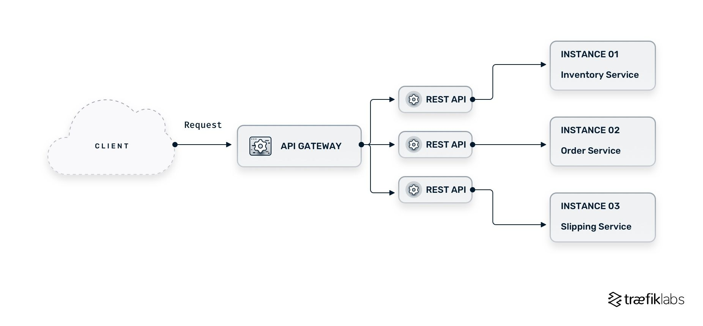

# What is an API Gateway?

An API Gateway acts as a mediator between client applications and the backend services within the microservices architecture. It is a software layer that functions as a single endpoint for various APIs performing tasks such as request composition, routing, and protocol translation. 



# Get started with the REST API console

In this getting started exercise, you create a serverless REST API using the API Gateway REST API console. Serverless APIs let you focus on your applications instead of spending your time provisioning and managing servers.   

First, you create a Lambda function using the Lambda console. Next, you create a REST API using the API Gateway REST API console. Then, you create an API method and integrate it with a Lambda function using a Lambda proxy integration. Finally, you deploy and invoke your API.  

When you invoke your REST API, API Gateway routes the request to your Lambda function. Lambda runs the function and returns a response to API Gateway. API Gateway then returns that response to you.  


## Step 1: Create a Lambda function

You use a Lambda function for the backend of your API. Lambda runs your code only when needed and scales automatically, from a few requests per day to thousands per second.

For this exercise, you use a default Node.js function in the Lambda console.

**To create a Lambda function** 
1. Sign in to the Lambda console at https://console.aws.amazon.com/lambda.

2. Choose Create function.

3. Under Basic information, for Function name, enter my-function.

4. For all other options, use the default setting.

5. Choose Create function.

The default Lambda function code should look similar to the following:

```
import json

def lambda_handler(event, context):
    response = {
        'statusCode': 200,
        'body': json.dumps('The API Gateway REST API console is great!')
    }
    return response

```

## Step 2: Create a REST API

Next, you create a REST API with a root resource (/).  

**To create a REST API**

1. Sign in to the API Gateway console at https://console.aws.amazon.com/apigateway.

2. Do one of the following:

    * To create your first API, for REST API, choose Build.

    * If you've created an API before, choose Create API, and then choose Build for REST API.

3. For API name, enter my-rest-api.

4. (Optional) For Description, enter a description.

5. Keep API endpoint type set to Regional.

6. Choose Create API.

## Step 3: Create a Lambda proxy integration

Next, you create an API method for your REST API on the root resource (/) and integrate the method with your Lambda function using a proxy integration. In a Lambda proxy integration, API Gateway passes the incoming request from the client directly to the Lambda function.

**To create a Lambda proxy integration**

1. Select the / resource, and then choose Create method.

2. For Method type, select ANY.

3. For Integration type, select Lambda.

4. Turn on Lambda proxy integration.

5. For Lambda function, enter my-function, and then select your Lambda function.

6. Choose Create method.


## Step 4: Deploy your API

Next, you create an API deployment and associate it with a stage.

**To deploy your API**
1. Choose Deploy API.

2. For Stage, select New stage.

3. For Stage name, enter Prod.

4. (Optional) For Description, enter a description.

5. Choose Deploy.

Now clients can call your API. To test your API before deploying it, you can optionally choose the ANY method, navigate to the Test tab, and then choose Test.

## Step 5: Invoke your API

**To invoke your API**
1. From the main navigation pane, choose Stage.

2. Under Stage details, choose the copy icon to copy your API's invoke URL.


3. Enter the invoke URL in a web browser.  

The full URL should look like https://abcd123.execute-api.us-east-2.amazonaws.com/Prod.  

Your browser sends a GET request to the API.  

4. Verify your API's response. You should see the text "The API Gateway REST API console is great!" in your browser.  

## (Optional) Step 6: Clean up

To prevent accruing unnecessary costs to your AWS account, delete the resources that you created as part of this exercise. The following steps delete your REST API, your Lambda function, and the associated resources.  

**To delete your REST API**

1. In the Resources pane, choose API actions, Delete API.

2. In the Delete API dialog box, enter confirm, and then choose Delete.

**To delete your Lambda function**

1. Sign in to the Lambda console at https://console.aws.amazon.com/lambda.

2. On the Functions page, select your function. Choose Actions, Delete.

3. In the Delete 1 functions dialog box, enter delete, and then choose Delete.

**To delete your Lambda function's log group**

1. Open the Log groups page of the Amazon CloudWatch console.

2. On the Log groups page, select your function's log group (/aws/lambda/my-function). Then, for Actions, choose Delete log group(s).

3. In the Delete log group(s) dialog box, choose Delete.

**To delete your Lambda function's execution role**

1. Open the Roles page of the IAM console.

2. (Optional) On the Roles page, in the search box, enter my-function.

3. Select your function's role (for example, my-function-31exxmpl), and then choose Delete.

4. In the Delete my-function-31exxmpl? dialog box, enter the name of the role, and then choose Delete.