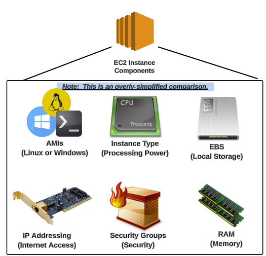
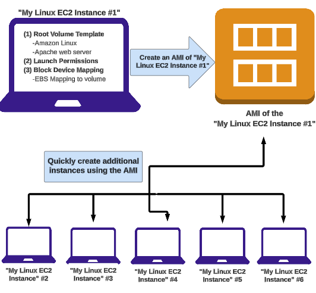

# AWS Processing Services 'Elastic Cloud Compute':

* **What is EC2?**
Think of EC2 as a basics desktop computer.  
Amazon EC2 provide a scalable computing capacity in the cloud. Using EC2 eliminates your need to invest in hardware up front. You can use EC2 to launch as many or as few virtual server as you need, configure security and networking and manage storage.

* **EC2 purchasing options**:
    * On-demand: Is the more expensive and flexible options
    * Reserved: Purchase Ec2 for a set time period of 1 to 3 years.
    * Spot: Is a way for you to bid on an EC2.



* **How are you charged for using EC2**:

    * Purchasing Options: On-demand, Reserved, Spot
    * Instance Type : the instance’s processing capacity 
    * EBS Optimized: An option for higher IOPS performance
    * AMI Type: Operating system (Linux, Windows)
    * Data Transfer: In/Out of the instance
    * Region: where the instance is provisioned.

* **What is AMI?**
A preconfigured package required to launch an EC2 instance that includes an operating system, software package and other required settings.  
You specify an AMI when you launch an EC2, and you can launch as many instances from the AMI as you need. You can launch from as many different AMI as you need.  
AMI come in 3 main categories:  
* Community AMI: Free to use
* AWS Marketplace AMI: Pay to use
* My AMI: AMI that you create your self




* **What is an instance type?**
The instance type is the processing capacity of your instance. Each instance type offers different compute, memory and storage capabilities and are grouped in instance families based on these capabilities.  
* **Instance types families:**
    * General Purpose: provide a balance of compute, memory and networking resources, and can be used for a variety of diverse workloads. 
    * Compute Optimized:  ideal for compute bound applications that benefit from high performance processors.
    * Memory Optimized:  designed to deliver fast performance for workloads that process large data sets in memory.
    * Accelerated Computing: use hardware accelerators, or co-processors, to perform functions, such as floating point number calculations, graphics processing, or data pattern matching, more efficiently than is possible in software running on CPUs.
    * Storage Optimized: designed for workloads that require high, sequential read and write access to very large data sets on local storage. 
    * HPC Optimized: purpose built o offer the best price performance for running HPC workloads at scale on AWS.


* **What is Amazon EBS**:
Amazon EBS (**Elastic Block Store**) provides block-level storage volumes that you can attach to a running instance. You can use Amazon EBS as a primary storage device for data that requires frequent and precise updates.  
For example, Amazon EBS is the recommended storage option when running a database on an instance.  
An EBS volume persists independently of the instance’s runtime. Once an EBS volume is attached to an instance, you can use it like any other physical hard drive.  
To keep a backup copy of your data, you can create a snapshot of an EBS volume, which is stored in Amazon S3. You can create a new EBS volume from a snapshot and then attach it to another instance.  
A snapshot of an EBS volume is a copy of the data in the volume stored in Amazon S3, where it is redundantly stored across multiple availability zones.  

## Start and Connect to an EC2 Instance
Click on Start an EC2 Instance:

1. Select an AMI (Community AMI – LAMP)
2. Choose an instance type (t2.micro)
3. Configure the instance: Add a script that will run at startup to install Apache.
```
bash
Copy
Edit
#!/bin/bash
yum update -y
yum install -y httpd
service httpd start
```
4. Add storage (for now, use the default storage)
5. Add tags (e.g., Name: webserver)
6.Configure a Security Group (SG) to allow inbound traffic for SSH (port 22) and HTTP (port 80) from 0.0.0.0/0
6. Review the instance configuration and launch the instance
7. Create and download the **Key Pair**
8. Click on create instance

## Connect to the EC2 Instance Using SSH
1. Use an SSH client like cmd on Windows (or use the terminal directly on Mac and Linux).
2. Click on "Connect" in the AWS console.
3. Check the permissions of your Key Pair:
```
chmod 400 keypair.pem
```
4. Connect to the instance using SSH:
```
ssh -i "keypair.pem" ec2-user@public-dns-ec2
```
5. Verify that the HTTP service is installed:
```
systemctl status httpd
```
6. Check if the Apache server is running by accessing the url from your browser:
```
http://public-ip:80
```
7. Ensure that NACL and SG rules allow inbound/outbound traffic on port 80

