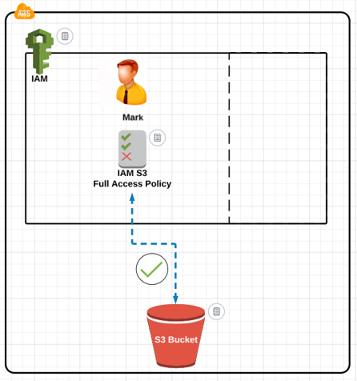
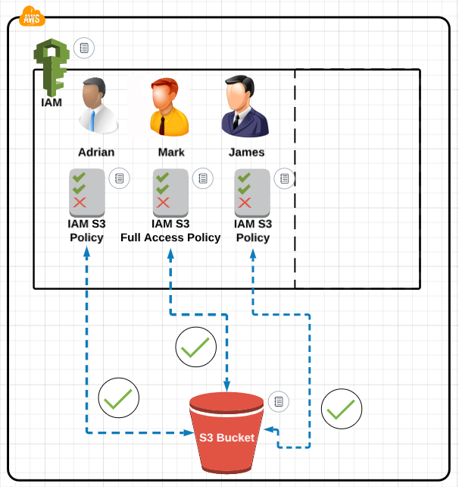
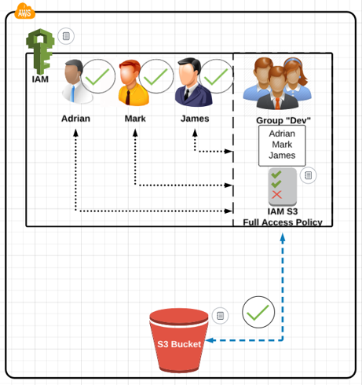
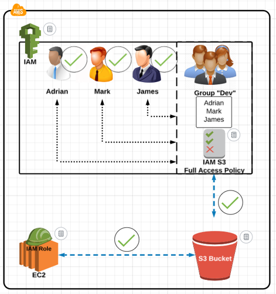

# AWS Security IAM :

* AWS Identity and Access Management (IAM)
* IAM Users and groups
* IAM Roles and Policy

## What is IAM:  
IAM (Identity and Access Management) is where you manage your AWS users/groups and their access to AWS accounts and services.
IAM is commonly used to manage:
* Users
* Groups
* Access Policies
* Roles

**Note:** The user created when tou created the AWS account is called the « root » user.
By default, the root user has full administrative rights and access to every part of the account.  
By default, any new users you create in the aws account are created with no access to any aws services.  
For all users (besides the root user), permissions must be given that grant access to AWS services.  

* **Create a user Mark using aws console**:

    * The user will be create without any permissions
    * Grant permissions to the user Mark
    * Attach a S3 full access policy to the user Mark

*  **You can create multiple users at once using aws console**:

    * Adrian and James users will be created without any permissions
    * Attach an exsiting S3 policy to allow Adrian and James access to S3 bucket

* **Create a group using aws console**:

    * Create a group **«Dev»**
    * Add users to the group
    * Attach IAM S3 policy to the group

* **Create a role using aws console**:
Suppose we have EC2 instance that need access to files wthin S3 bucket  
    * We cannot attach IAM policy to the EC2.
    * We need to create IAM role.  
    * Attach the IAM policy to the role to allow EC2 to access the S3 bucket.  

## AWS CLI install instructions:

The AWS Command Line Interface (AWS CLI) is a unified tool to manage your AWS services. With just one tool to download and configure, you can control multiple AWS services from the command line and automate them through scripts.  

For installation instructions, go to this link: https://docs.aws.amazon.com/cli/latest/userguide/getting-started-install.html

## Configure AWS CLI:

For configuration instructions, go to this link
https://docs.aws.amazon.com/cli/latest/userguide/cli-chap-configure.html