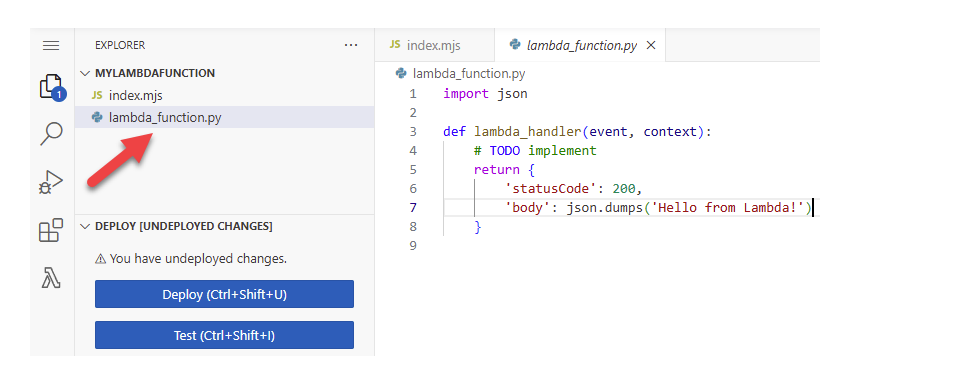

# What is AWS Lambda?

You can use AWS Lambda to run code without provisioning or managing servers.

Lambda runs your code on a high-availability compute infrastructure and performs all of the administration of the compute resources, including server and operating system maintenance, capacity provisioning and automatic scaling, and logging. With Lambda, all you need to do is supply your code in one of the language runtimes that Lambda supports.


# When to use Lambda

Lambda is an ideal compute service for application scenarios that need to scale up rapidly, and scale down to zero when not in demand. For example, you can use Lambda for:

* **File processing**: Use Amazon Simple Storage Service (Amazon S3) to trigger Lambda data processing in real time after an upload.

* **Stream processing**: Use Lambda to process real-time streaming data for application activity tracking, transaction order processing, clickstream analysis, data cleansing, log filtering, indexing, social media analysis, Internet of Things (IoT) device data telemetry, and metering.

* **Web applications**: Combine Lambda with other AWS services to build powerful web applications that automatically scale up and down and run in a highly available configuration across multiple data centers.

* **IoT backends**: Build serverless backends using Lambda to handle web, mobile, IoT, and third-party API requests.

* **Mobile backends**: Build backends using Lambda and Amazon API Gateway to authenticate and process API requests. 

# Create your first Lambda function:

To get started with Lambda, use the Lambda console to create a function. In a few minutes, you can create and deploy a function and test it in the console.  

## Create a Lambda function with the console

In this example, your function takes a JSON object containing two integer values labeled **"length"** and **"width"**. The function multiplies these values to calculate an area and returns this as a JSON string.

To create a Hello world Lambda function with the console

1. Open the Functions page of the Lambda console.

2. Choose Create function.

3. Select Author from scratch.

4. In the Basic information pane, for Function name, enter myLambdaFunction.

5. For Runtime, choose Python 3.13.

6. Leave architecture set to x86_64, and then choose Create function.

In addition to a simple function that returns the message **Hello from Lambda!**, Lambda also creates an **execution role** for your function. An **execution rol**e is an **AWS Identity and Access Management (IAM) role** that grants a Lambda function **permission** to access AWS services and resources. For your function, the **role** that Lambda creates grants basic **permissions** to write to **CloudWatch** Logs.



To modify the code in the console:  

1. Choose the Code tab.

2. Paste the following code into the lambda_function.py tab, replacing the code that Lambda created.

```
import json
import logging

logger = logging.getLogger()
logger.setLevel(logging.INFO)

def lambda_handler(event, context):
    
    # Get the length and width parameters from the event object. The 
    # runtime converts the event object to a Python dictionary
    length = event['length']
    width = event['width']
    
    area = calculate_area(length, width)
    print(f"The area is {area}")
        
    logger.info(f"CloudWatch logs group: {context.log_group_name}")
    
    # return the calculated area as a JSON string
    data = {"area": area}
    return json.dumps(data)
    
def calculate_area(length, width):
    return length*width
```

3. In the DEPLOY section, choose Deploy to update your function's code.

## Invoke the Lambda function using the console code editor

To invoke your function using the Lambda console code editor, create a test event to send to your function. The event is a JSON formatted document containing two key-value pairs with the keys **"length"** and **"width"**.

To create the test event:  
1. In the TEST EVENTS section of the console code editor, choose Create test even
2. For Event Name, enter myTestEvent.
3. In the Event JSON section, replace the default JSON with the following:
```
{
  "length": 6,
  "width": 7
}
```
4. Choose Save.
To test your function and view invocation records.

When your function finishes running, the response and function logs are displayed in the OUTPUT tab. You should see results similar to the following:

```
Status: Succeeded
Test Event Name: myTestEvent

Response
"{\"area\": 42}"

Function Logs
START RequestId: 2d0b1579-46fb-4bf7-a6e1-8e08840eae5b Version: $LATEST
The area is 42
[INFO]	2024-08-31T23:43:26.428Z	2d0b1579-46fb-4bf7-a6e1-8e08840eae5b	CloudWatch logs group: /aws/lambda/myLambdaFunction
END RequestId: 2d0b1579-46fb-4bf7-a6e1-8e08840eae5b
REPORT RequestId: 2d0b1579-46fb-4bf7-a6e1-8e08840eae5b	Duration: 1.42 ms	Billed Duration: 2 ms	Memory Size: 128 MB	Max Memory Used: 39 MB	Init Duration: 123.74 ms

Request ID
2d0b1579-46fb-4bf7-a6e1-8e08840eae5b
```

**To view your function's invocation records in CloudWatch Logs:**  

1. Open the Log groups page of the CloudWatch console.

2. Choose the log group for your function (/aws/lambda/myLambdaFunction). This is the log group name that your function printed to the console.

3. Scroll down and choose the Log stream for the function invocations you want to look at.

**To delete the Lambda function**  

1. Open the Functions page of the Lambda console.

2. Select the function that you created.

3. Choose Actions, Delete.

4. Type confirm in the text input field and choose Delete.