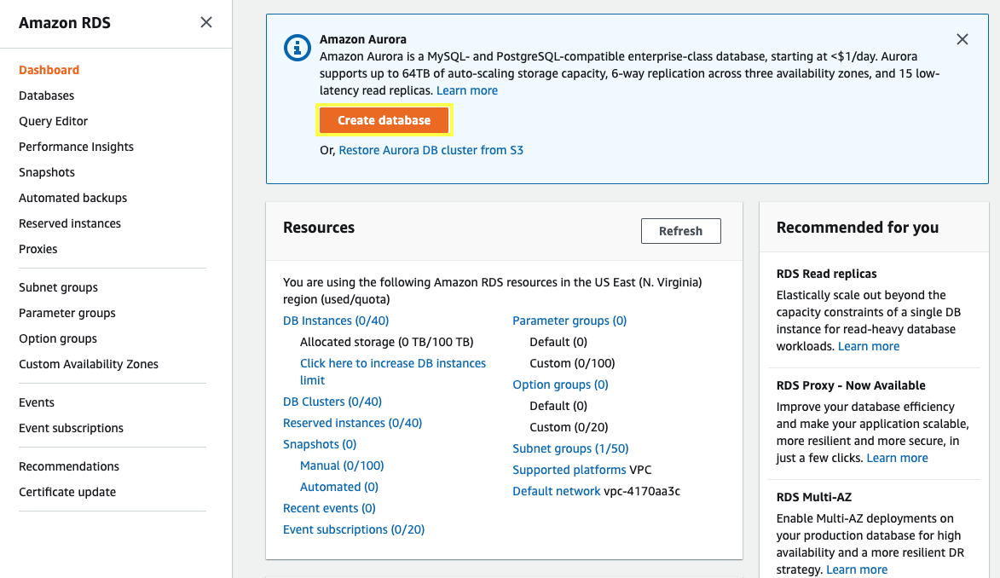
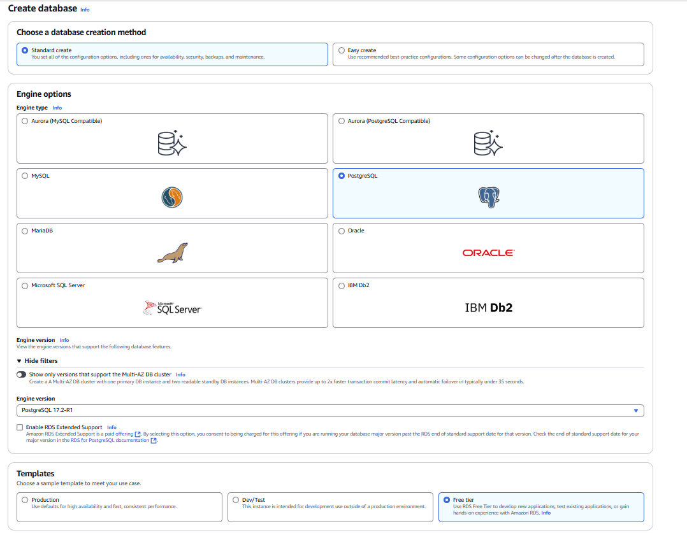
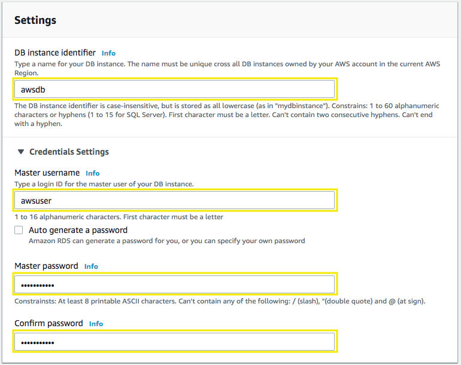
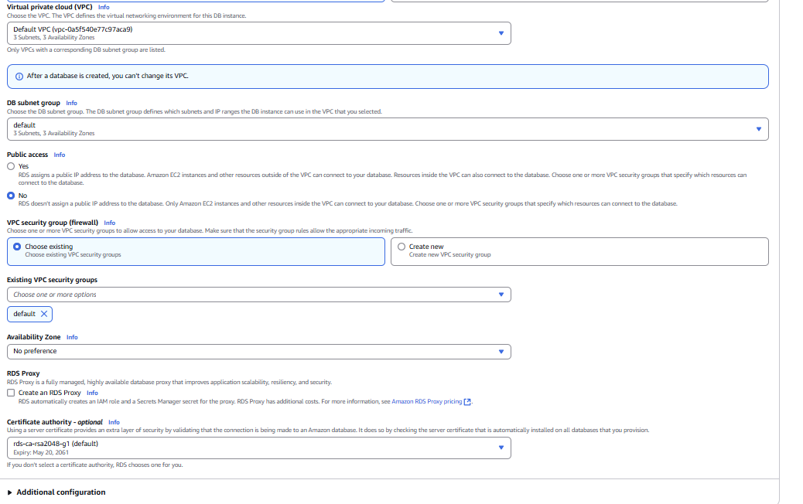

# What is Amazon Relational Database Service (Amazon RDS)?

Amazon Relational Database Service (Amazon RDS) is a web service that makes it easier to set up, operate, and scale a relational database in the AWS Cloud. It provides cost-efficient, resizable capacity for an industry-standard relational database and manages common database administration tasks.

## RDS DB engines
A DB engine is the specific relational database software that runs on your DB instance. Amazon RDS supports the following database engines:
* IBM Db2

* MariaDB

* Microsoft SQL Server

* MySQL

* Oracle Database

* PostgreSQL

Each DB engine has its own supported features, and each version of a DB engine can include specific features.

## RDS DB instance classes
A DB instance class determines the computation and memory capacity of a DB instance. A DB instance class consists of both the DB instance class type and the size. Amazon RDS supports the following instance class types.

* General purpose – db.m*

* Memory optimized – db.z*, db.x*, db.r*

* Compute optimized – db.c*

* Burstable performance – db.t*

Each instance class offers different compute, memory, and storage capabilities.

## RDS DB instance storage:

Amazon EBS provides durable, block-level storage volumes that you can attach to a running instance. DB instance storage comes in the following types:

* **General Purpose (SSD)**

This cost-effective storage type is ideal for a broad range of workloads running on medium-sized DB instances. General Purpose storage is best suited for development and testing environments.

* **Provisioned IOPS (PIOPS)**

This storage type is designed to meet the needs of I/O-intensive workloads, particularly database workloads, that require low I/O latency and consistent I/O throughput. Provisioned IOPS storage is best suited for production environments.

* **Magnetic**

Amazon RDS supports magnetic storage for backward compatibility. We recommend that you use General Purpose SSD or Provisioned IOPS SSD for any new storage needs.

The storage types differ in performance characteristics and price. You can tailor your storage performance and cost to the requirements of your database.

## Launch an RDS Innstance:

1. Open the Amazon RDS console at https://console.aws.amazon.com/rds.
2. Click on Create database.

3. We will be using a **Standard Create** method, choose **Postgresql** from the Engine Options, scroll down and in Templates section select **Free tier**.

4. Scroll down, for the Settings section fill out with the following information:

* DB instance identifier: awsdb
* Master username: awsuser
* Master Password: awspassword
* Confirm Password: awspassword

5. Scroll down, for the DB instance size and Storage sections leave the values as default.

6. Scroll down, for the Connectivity section select your My VPC and for VPC security group select the default security group.

7. Scroll down and click on Additional configuration, for Initial database name: **retaildb**

8. Scroll down and choose Create database.