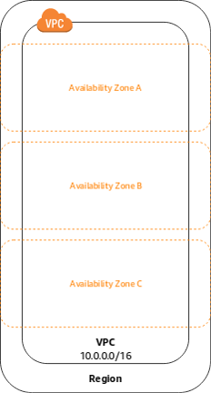

# aws-training

## Summary:

* Section 1 : Introduction to aws cloud  

* Section 2 : AWS Network  

* Section 3 : AWS Security  

* Section 4 : AWS Storage services  

* Section 5 : AWS Processing Services  

* Section 6 : AWS Databases Services  

* Section 7 : AWS Analytic Services  

* Section 8 : AWS ML & IA Services  

# Introduction to aws cloud:  

* The AWS global infrastructure

* The AWS Shared responsibility model

* The AWS princing fundamentals

**Cloud computing** is the delivery of **computing services**: Servers, Storage, Databases, Networking, Software, Analytics, Intelligence and more, **over the internet (The cloud)** to offer faster innovation, flexible resources and economies of scale.

You typically **pay only for cloud services you use**, helping lower your operating costs, run your infrastructure more efficiently, and scale as your business needs change. 

There are many cloud hosting providers; however, very few offer a range of products to host, from a simple static website to complex machine learning and AI applications.

While the terms **flexibility**, **portability**, **modularity**, and **elasticity** are commonly associated with it, the cloud also raises concerns: **75%** of surveyed companies believe that the **Cloud Act** and the **Patriot Act** in effect in the United States pose a risk to **data security**.

As a reminder, the **Cloud Act** is a U.S. federal law enacted in March 2018, allowing **judicial or administrative authorities (federal or local)** to obtain from **telecom operators and cloud computing service providers** established in the United States information stored on their servers, whether they are based in the U.S. or in foreign countries.

Despite concerns and questions, few European companies use solutions from European cloud providers **(Orange, OVHcloud, Scaleway by Illiad, Atos, Docaposte, Outscale)**. The market is largely dominated by five players **Amazon Web Services, Microsoft Azure, Alibaba Cloud, Google Cloud, and IBM Cloud** which accounted for 80% of the global market.

Amazon is the world champion in research and development investment.  
Amazon's R&D budget in 2020 is equivalent to the revenue of a company like Orange or Renault.  

## The AWS Global Infrastructure is made up of:
* **AWS Regions**:
    * A region is a geographical area
    * Each region consists of 2 or more availability zones
    * Isolated from other AWS Regions

* **Availability Zones**:
    * Availability Zones are physically separate and isolated from each other
    * AZs span one or more data centers
    * Each AZ is designed as an independent failure zone

* **Local Zones**:
    * AWS Local Zones place compute, storage, database, and other select
    * AWS services closer to end-users
    * Extension of an AWS Region where you can run your latency sensitive applications

**AWS Global Infrastructure Map** : https://aws.amazon.com/about-aws/global-infrastructure/  

The AWS Cloud spans 105 Availability Zones within 33 geographic regions around the world, with announced plans for 15 more Availability Zones and 5 more AWS Regions in Germany, Malaysia, Mexico, New Zealand, and Thailand.  

In addition, AWS has 38 Local Zones and 29 Wavelength Zones for ultralow latency applications, it served 245 Countries and Territories, and it has 115 Direct Connect Locations.

* **AWS Regions**:
When you view your resources, you see only the resources that are tied to the Region that you specified. This is because Regions are isolated from each other, and we don't automatically replicate resources across Regions.  

* **Availability Zones**:
Each Region has multiple, isolated locations known as Availability Zones. The code for Availability Zone is its Region code followed by a letter identifier. 
For example, Europe (Paris) region eu-west-3 has 3 AZ:
* eu-west-3a
* eu-west-3b
* eu-west-3c

**AWS Global Infrastructure**

https://aws.amazon.com/about-aws/global-infrastructure/

## The AWS Shared responsibility model:

* **IAAS**: Infrastructure As A Service is offered by platforms such as Amazon EC2. You buy time on these services, and install and configure your own software, such as a Hadoop cluster or NoSQL database.
Using IaaS gives you a broad choice of cloud supplier, the full control of your software life cycle, but you'll be responsible for deploying, managing and maintaining your clusters.

* **PAAS**: Beyond IaaS, several cloud services provide application layer support for big data work. Sometimes referred to as managed solutions, or Platform As A Service such as Amazon Redshift, these services remove the need to configure or scale things such as databases or processing engine, reducing your workload and maintenance burden.

* **SAAS**: Software As A Service such as Snowflake integrates many of the functionalities and benefits of IaaS and PaaS and additional capabilities like data sharing to deliver advanced analysis of large datasets

The AWS shared responsibility model defines customer/AWS responsibilities:  

* **AWS are responsible for “Security of the Cloud”**
    * AWS is responsible for protecting the infrastructure that runs all of the services offered in the AWS Cloud
    * This infrastructure is composed of the hardware, software, networking, and facilities that run AWS Cloud services

* **Customers are responsible for “Security in the Cloud”**
    * For EC2 this includes network level security, operating system patches and updates, IAM user access management, and client and server-side data encryption

## Fundamentals of pricing:

* Compute – CPU/RAM and duration
* Storage – quantity of data stored or allocated
* Outbound data transfer – data leaving an AWS Region

**AWS Pricing Calculator**, Estimate the cost of your aws solution architecture. 
https://calculator.aws

# AWS Network :

* AWS Virtual Private Cloud (VPC)
* AWS public and private Subnets 
* AWS Security Groups and Network ACLs
* AWS public and private IP addresses

## AWS Virtual Private Cloud (VPC):

**What is a VPC?**  
It is a private subsection of AWS network that you control, into which you can place AWS resources.  
You have full control over who has access to the AWS resources that you place inside you VPC.  
Note: When you create an aws account, a « default VPC » is created for you.  It includes the standard components that are needed make it functional.  

When you create a new VPC, you must specify an IPv4 address range for the VPC in the form of a CIDR (Classless Inter-Domain Routing) block, for example, 10.0.0.0/16. This is the primary CIDR block for your VPC.

A VPC spans all availability zones in the region.

The Default VPC includes the standard network components:

* Subnets
* Internet Gateway
* Route Table
* Network Access Control List and Security group

* **What is Subnets**:
After creating a VPC, you can add one or more subnets in each availability zone. A subnet is an IP address range within your VPC.

You can launch AWS resources, such as EC2 instances, in a specific subnet. When you create a subnet, you specify its IPv4 CIDR block, which is a subset of the VPC's CIDR block. Each subnet must be entirely contained within a single availability zone and cannot span multiple zones.

If you create multiple subnets within a VPC, their CIDR blocks cannot overlap.

* **Example**:
If you create a VPC with the CIDR block 10.0.0.0/24 (10.0.0.0 - 10.0.0.255), it supports 256 IP addresses. You can split this CIDR block into two subnets, each supporting 128 IP addresses.

* **High Availability:**
Creating your architecuture in such a way that your system is always availabale (or has the least amount of downtime as possible)
* I can always access my data in the cloud
* My application never crashes and is always available to my customer

* **What is NACL:**
A network access control list (NACL) is an optional layer of security for your VPC that acts as a firewall for controlling traffic in and out of one or more subnets.

**Note:** Your default VPC already has an NACL in place and associated with the default subnets.

* **What is Security group - SG:**
An AWS Security Group is a virtual firewall that controls inbound and outbound traffic for AWS resources, such as EC2 instances, RDS databases, and Lambda functions (when using VPC). It acts as a stateful firewall, meaning:

* If you allow inbound traffic, the corresponding outbound response is automatically allowed.
* If you allow outbound traffic, the corresponding inbound response is automatically allowed.

* **Example Use Cases**:
* Web Server Security Group:
    * Allow inbound HTTP (port 80) and HTTPS (port 443) from the internet.
    * Allow SSH (port 22) only from a specific IP range.
    * Allow outbound traffic to anywhere.

* Database Security Group:
    * Allow inbound MySQL (port 3306) only from the application server's security group.
    * Block all other inbound access.
    * Allow outbound traffic to the application server.

# AWS Security IAM : https://github.com/atifrani/aws-training/tree/main/IAM

* AWS Identity and Access Management (IAM)
* IAM Users and groups
* IAM Roles and Policy
