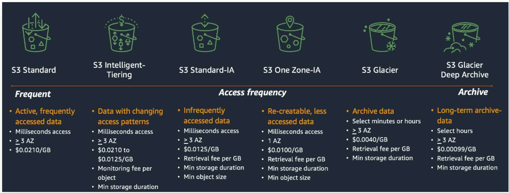

# What is Amazon S3?

Amazon Simple Storage Service (Amazon S3) is an object storage service that offers industry-leading scalability, data availability, security, and performance. Customers of all sizes and industries can use Amazon S3 to store and protect any amount of data for a range of use cases, such as data lakes, websites, mobile applications, backup and restore, archive, enterprise applications, IoT devices, and big data analytics. Amazon S3 provides management features so that you can optimize, organize, and configure access to your data to meet your specific business, organizational, and compliance requirements.

# How Amazon S3 works

Amazon S3 is an object storage service that stores data as objects within buckets. An object is a file and any metadata that describes the file. A bucket is a container for objects.

To store your data in Amazon S3, you first create a bucket and specify a bucket name and AWS Region. Then, you upload your data to that bucket as objects in Amazon S3. Each object has a key (or key name), which is the unique identifier for the object within the bucket.

S3 provides features that you can configure to support your specific use case. For example, you can use S3 Versioning to keep multiple versions of an object in the same bucket, which allows you to restore objects that are accidentally deleted or overwritten.

Buckets and the objects in them are private and can be accessed only if you explicitly grant access permissions. You can use bucket policies, AWS Identity and Access Management (IAM) policies, access control lists (ACLs), and S3 Access Points to manage access.

* **Buckets**:
A general purpose bucket is a container for objects stored in Amazon S3.

* **Objects**:
Objects are the fundamental entities stored in Amazon S3. Objects consist of object data and metadata. 

* **Keys**:
An object key (or key name) is the unique identifier for an object within a bucket.

* **S3 Versioning**:
You can use S3 Versioning to keep multiple variants of an object in the same bucket.
When you enable S3 Versioning in a bucket, Amazon S3 generates a unique version ID for each object added to the bucket.

* **Bucket policy**:
A bucket policy is a resource-based AWS Identity and Access Management (IAM) policy that you can use to grant access permissions to your bucket and the objects in it. 

* **S3 Access Points**:
Amazon S3 Access Points are named network endpoints with dedicated access policies that describe how data can be accessed using that endpoint.

* **Access control lists (ACLs)**:
You can use ACLs to grant read and write permissions to authorized users for individual buckets and objects.

* **Regions**:
You can choose the geographical AWS Region where Amazon S3 stores the buckets that you create. 

* **Storage class**:
Amazon S3 offers a range of storage classes that you can choose from based on the performance, data access, resiliency, and cost requirements of your workloads. S3 storage classes are purpose-built to provide the lowest cost storage for different access patterns. S3 storage classes are ideal for virtually any use case, including those with demanding performance needs, data lakes, data residency requirements, unknown or changing access patterns, or archival storage.  

