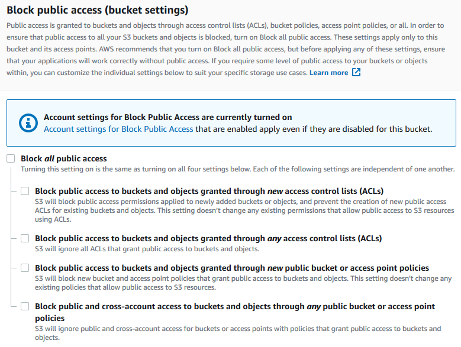

# Configuring a static website on Amazon S3:

You can configure an Amazon S3 bucket to function like a website. This example walks you through the steps of hosting a website on Amazon S3.

## Step 1: Create a bucket:
The following instructions provide an overview of how to create your buckets for website hosting. For detailed, step-by-step instructions on creating a bucket.

To create a bucket

Sign in to the AWS Management Console and open the Amazon S3 console at https://console.aws.amazon.com/s3/.

1. Choose Create bucket.

2. Enter the Bucket name (for example, example.com).

3. Choose the Region where you want to create the bucket.
Choose a Region that is geographically close to you to minimize latency and costs, or to address regulatory requirements. The Region that you choose determines your Amazon S3 website endpoint. For more information, see Website endpoints.

5. To accept the default settings and create the bucket, choose Create.

## Step 2: Enable static website hosting

After you create a bucket, you can enable static website hosting for your bucket. You can create a new bucket or use an existing bucket.

**To enable static website hosting**
Sign in to the AWS Management Console and open the Amazon S3 console at https://console.aws.amazon.com/s3/.  

1. In the left navigation pane, choose General purpose buckets.

2. In the buckets list, choose the name of the bucket that you want to enable static website hosting for.

3. Choose Properties.

4. Under Static website hosting, choose Edit.

5. Choose Use this bucket to host a website.

6. Under Static website hosting, choose Enable.

7. In Index document, enter the file name of the index document, typically index.html.

8. Choose Save changes.

9. Under Static website hosting, note the Endpoint.
The Endpoint is the Amazon S3 website endpoint for your bucket. After you finish configuring your bucket as a static website, you can use this endpoint to test your website.

## Step 3: Edit Block Public Access settings

By default, Amazon S3 blocks public access to your account and buckets. If you want to use a bucket to host a static website, you can use these steps to edit your block public access settings.

1. Choose the name of the bucket that you have configured as a static website.

2. Choose Permissions.

3. Under Block public access (bucket settings), choose Edit.

4. Clear Block all public access, and choose Save changes.

