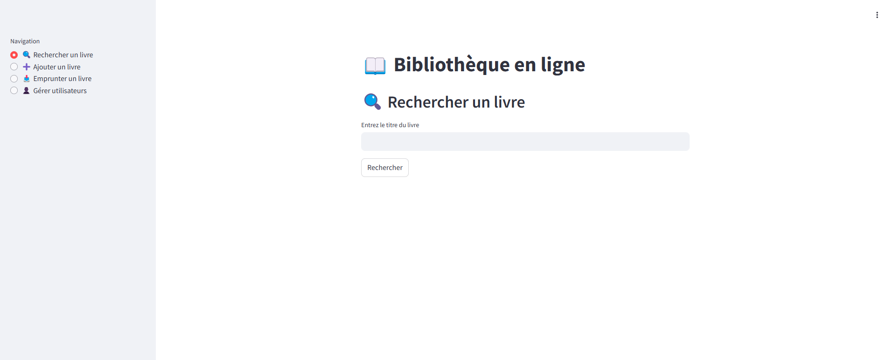

# Workshop :

This application is built with Python FastAPI and Streamlit frameworks and POSTGRESQL  integrating for CRUD operations (Create, Read, Update, Delete) on books and users. 

* FastAPI is a powerful web framework for building APIs, 
* Streamlit is UI web framework to deliver dynamic data apps with only a few lines of code,  
* POSTGRESQL is a SQL database that provides flexibility and scalability.

## Backend: 
FastAPI for managing books and users
This backend exposes REST endpoints for adding, searching, borrowing books, and managing users.

## Frontend: 
Streamlit to deliver web UI to interact with the backend.

## Create aws infrastructure:
We will create some aws services to host the application.

1. Create aws Security group for EC2.

You need to update the following commands before run it in your terminal.

```
aws ec2 create-security-group --group-name ec2-SecurityGroup --description "Security group for HTTP and SSH access"
```

This command returns a **GroupId**, which you will use in the next steps.

**Authorize Inbound HTTP Traffic (Port 80)**:
```
aws ec2 authorize-security-group-ingress --group-name ec2-SecurityGroup --protocol tcp --port 80 --cidr 0.0.0.0/0
```
This allows anyone on the internet to access the server via HTTP.

**Authorize Inbound SSH Traffic (Port 22)**:
```
aws ec2 authorize-security-group-ingress --group-name ec2-SecurityGroup --protocol tcp --port 22 --cidr 0.0.0.0/0
```
This allows SSH access from anywhere.

**Launch an EC2 Instance**:

```
aws ec2 run-instances \
    --image-id ami-1234567890abcdef0 \ # Replace with a valid AMI ID (e.g., Amazon Linux 2)
    --instance-type t2.micro \
    --key-name MyKeyPair \ # Replace with your key pair name
    --security-group-ids sg-xxxxxxxx \ # Replace with the GroupId from Step before
    --count 1 \
    --tag-specifications 'ResourceType=instance,Tags=[{Key=Name,Value=WorkshopEC2Instance}]'
```

**Connect to the EC2 Instance**:

Go the the aws console:
1. select EC2 service and click on instances.
2. Select your EC2 instance
3. click on connect button
4. Connect using EC2 instance connect


# Clone or donwload the project:

1. Install git on EC2 instance:

```
sudo yum install git -y
```

2. Clone the repository:

```
git clone https://github.com/atifrani/aws-training.git
```

# Create python virtualenv:

```
cd aws-training/aws-library-project/

python3 -m venv venv

```

## Activate the virtualenv

```
source venv/bin/activate 
```

# Install the dependencies:

```
pip3 install -r requierements.txt

```

## Launch the Frontend:

on the ec2 terminal run this command:

```
streamlit run frontend.py
```
Visite this url **http://ec2-pulic-ip:8501/**  # replace ec2-pulic-ip with the public ip on your ec2 instance.



* **Hints**:
If your web page is not displaying, check that traffic is open between your computer and your EC2 instance.


We already have the streamlit web app frontend available, now we need to connect the frontend ton the backend.
I you try any action on the frentend, you get error because the backend is not available.
Stop the frontend by clicking on **CTRL + C**.

## Launch the backend:

Before starting your backend application, you need to make some update.
Open the backend file.

```
nano backend.py
```
Update the information relate to your RDS Database. You need to restart you RDS database first.  
To save the file, click on **CRTL + X** and click on **ENTER**

1. Install Ngnix:

```
sudo yum install ngnix -y
```

2. Start Ngnix
```
sudo systemctl start nginx
sudo systemctl enable nginx
```

3. Configure Fastapi service:

```
sudo nano /etc/systemd/system/fastapi.service
```

Copy and past the following content:

```
[Unit]
   Description=FastAPI application
   After=network.target

   [Service]
   User=ec2-user
   WorkingDirectory=/home/ec2-user/aws-training/aws-library-project
   ExecStart=/home/ec2-user/aws-training/aws-library-project/venv/bin/uvicorn backend:app --host 0.0.0.0 --port 8000
   Restart=always

   [Install]
   WantedBy=multi-user.target
```

To save the file, click on **CRTL + X** and click on **ENTER**

3. Start the FastAPI service:

```
   sudo systemctl daemon-reload
   sudo systemctl enable fastapi
   sudo systemctl start fastapi
   sudo systemctl status fastapi

```

Visite this url **http://ec2-pulic-ip:8000/docs**  # replace ec2-pulic-ip with the public ip on your ec2 instance.

* **Hints**:
If your web page is not displaying, check that traffic is open between your computer and your EC2 instance.

## launch the Frontend:

Open a terminal and run this command:

```
streamlit run frontend.py
```

Visite this url **http://ec2-pulic-ip:8501/**  # replace ec2-pulic-ip with the public ip on your ec2 instance.

* **Hints**:
If your web page is not displaying, check that traffic is open between your computer and your EC2 instance.

## Test your application:

Go to the frentend ui **http://ec2-pulic-ip:8501/**   
Try the differents options that you have on the navigation panle.  
 * Ajouter un livre
 * rechercher un livre
 * Emprunter un livre
 * Gérer utilisateurs

Connect to your RDS database using DBeaver and navigate to the public schema.  
Verify that the books and users tables are created and contain data.  
